# Watch Wolf (वॉच वुल्फ 🐺)

> Track 4: Sentiment Analysis of social media posts
<br/>

> Website: https://watch-wolf.vercel.app/

# Problem Statement & Expectation

People are only a click away from obtaining vast amounts of data. With information comes people's opinions, and with that comes people's positive and negative perspectives on a subject. This can lead to bullying and the spread of hateful remarks about someone or something. 

The solution must be able to classify the sentiments that are expressed in the text source which is associated with that user on platforms such as Facebook, Instagram, and Twitter. It should accurately identify when the tone of the posts becomes inflammatory and hateful.

# Solution
Watch Wolf is the web platform that analyze the sentiment and provides the sentiment and entities report
for the text, images and PDF attachment. This is possible with hindi and english language. In addition to this features, the platform also provides the tweet analysis wherein the user can provide the tweet URL and the user is provided with the information of tweet, sentiment and entity report. Along with this, watch wolf provides a chrome extension whose major features includes injecting sentiment scores and mail service feature on the tweets directly observed on twitter.

# Tech Stack

## Front-end 
1. `Framework`: NextJS 
2. `Styling`: CSS, React-bootstrap
3. `API`: Fetch, Axios
3. `Deployment`: Vercel

## Back-end 
1. `Framework`: Spring Boot, Java
2. `API`: AWS (Comprehend, Rekognition), Twitter API, JUnit, Apache PDFBox
3. `Deployment`: AWS EC2

## Chrome Extension 
1. `Framework`: Vanilla Javascript
2. `API`: Chrome Extension Manifest V3

# Setup on local computer
Clone this particular repo - `git clone https://github.com/AemieJ/watch-wolf-client.git`

## Client-side
Open a terminal and perform the following steps:

1. Move into the client directory: `cd client`
2. Change from production ➡️ development environment by moving to config directory and performing following changes:

    ```javascript
    // server.js
    const dev = "development";
    ```

    ```javascript
    // client.js
    const dev = "development";
    ```

3. Open the terminal again within the client directory and include the following commands: 
    ```bash
    $ yarn && yarn dev
    ```
    OR 
    ```bash
    $ npm install && npm run dev
    ```

4. Client side will be up and running on `http://localhost:3000`

## Chrome Extension 
1. Open chrome and type in `chrome://extensions`
2. Switch on the developer mode and select on load unpacked
3. Select the extension folder
4. For demo, you can move to particular hashtag on the official twitter website and 
observe the features of the extension

## Server-side
The server side instructions are provided on a separate repository - `https://github.com/godcrampy/watch-wolf-api`.


# UI Interface of Watch Wolf

## Landing Page
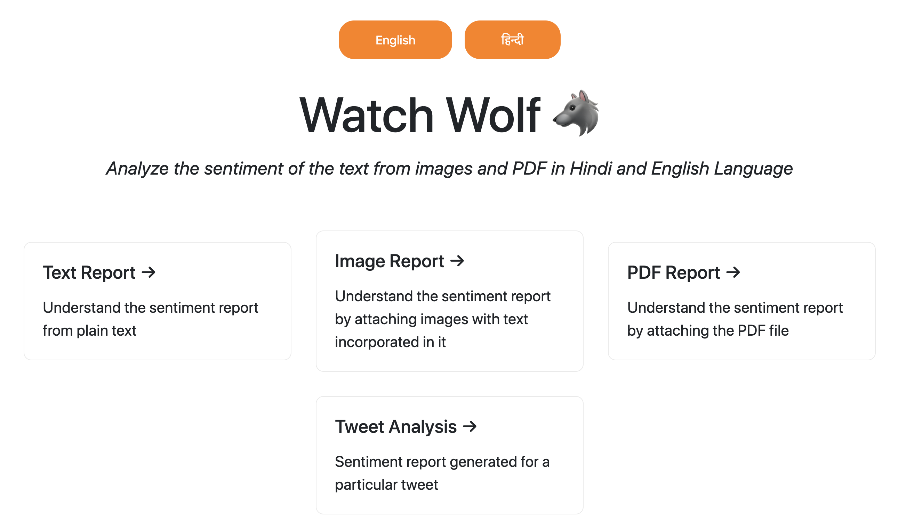
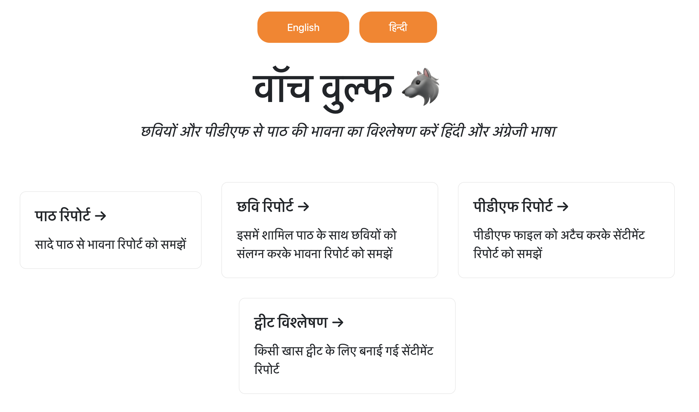

## Text Analysis
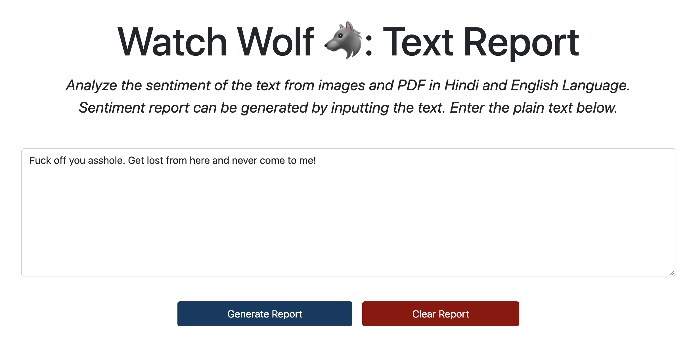
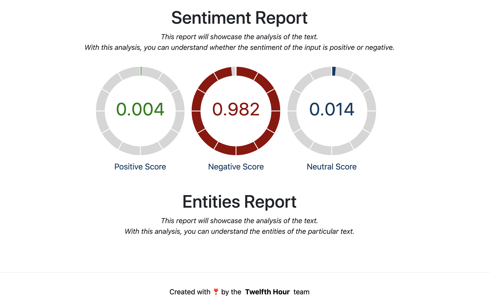

## Image Analysis
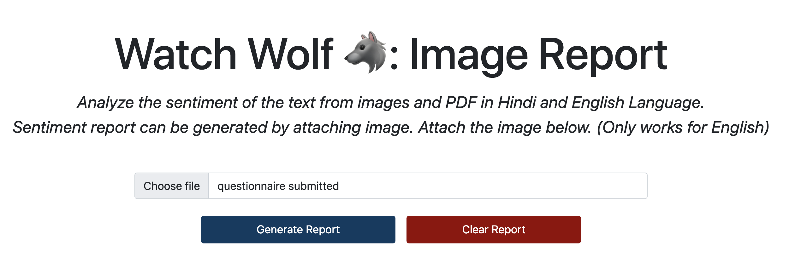
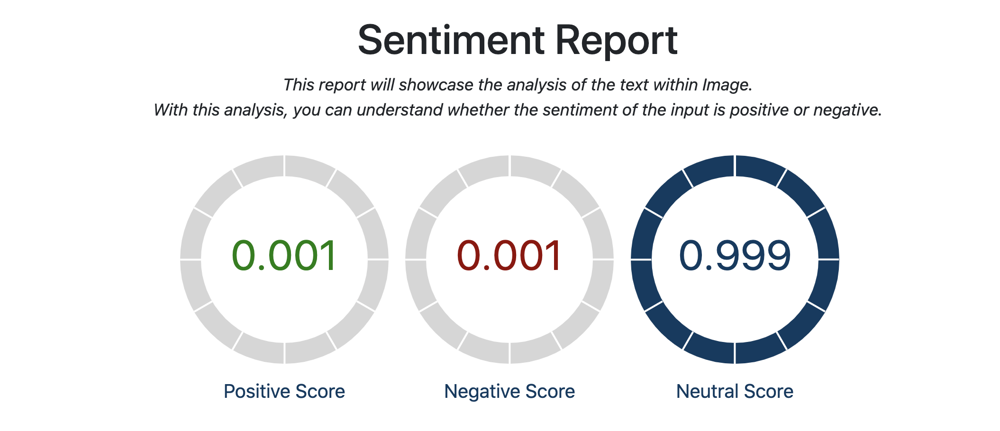
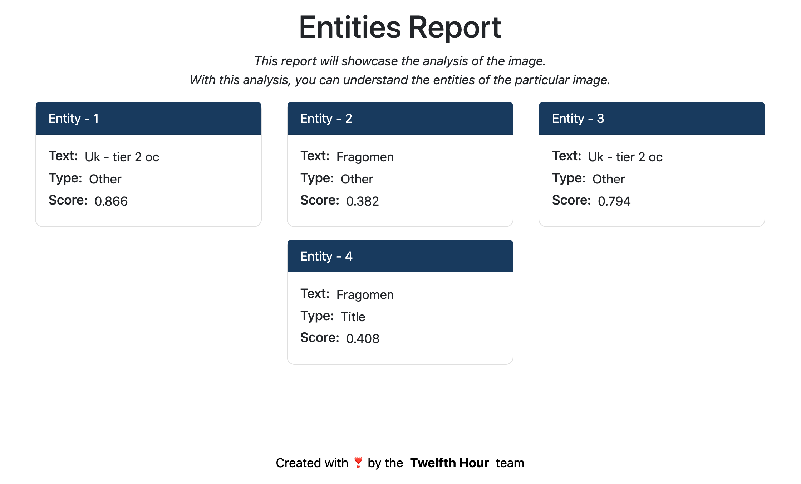

## PDF Analysis

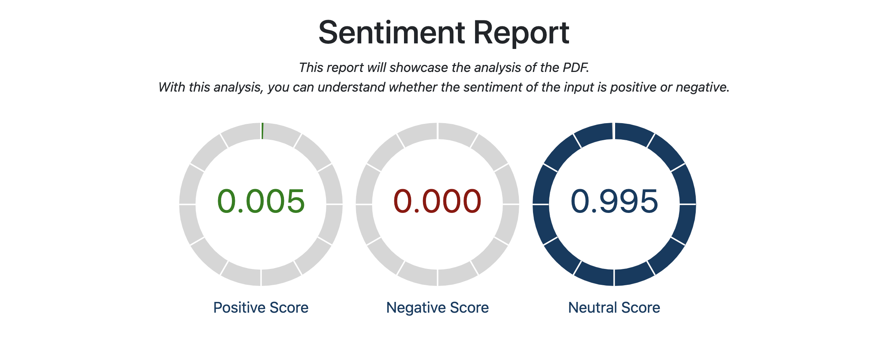
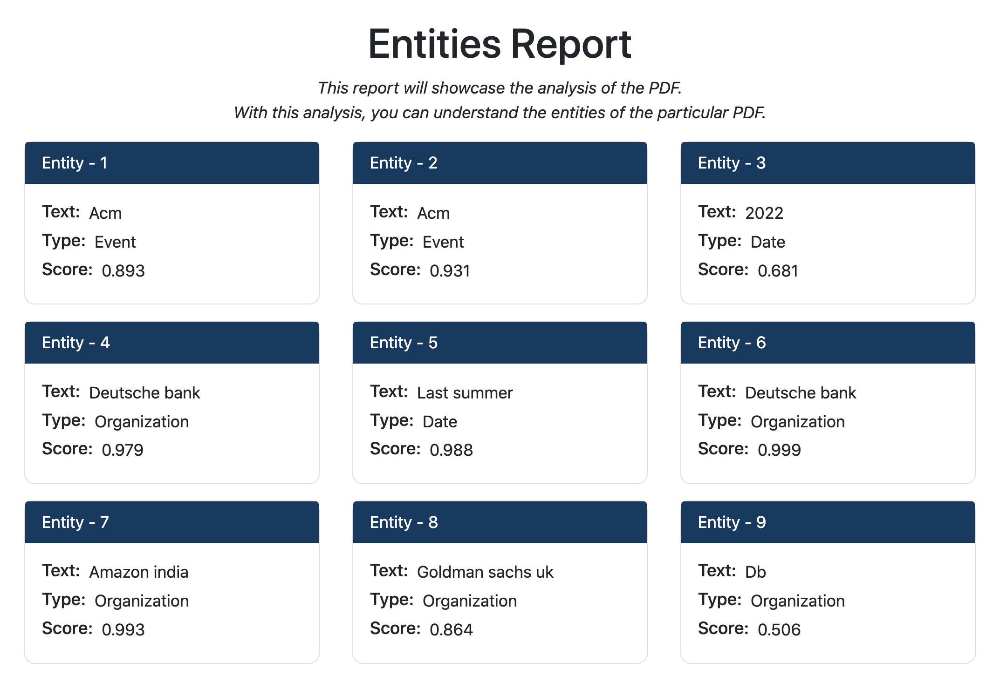

## Tweet Analysis [English]
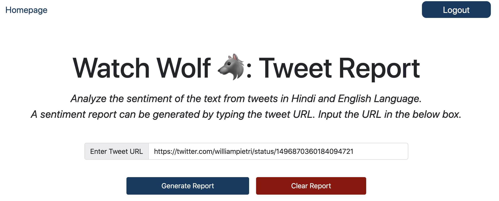
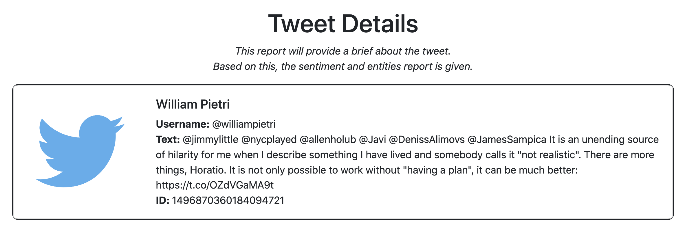
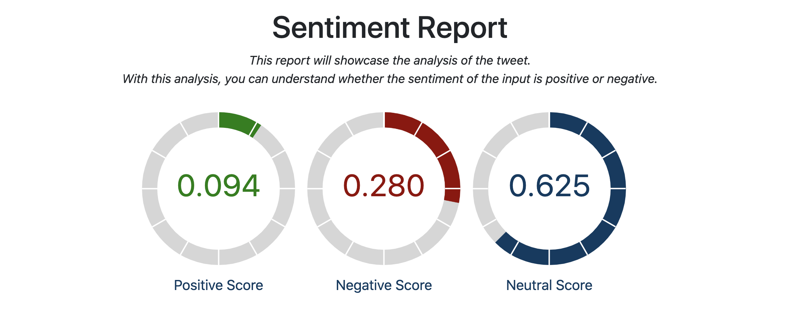
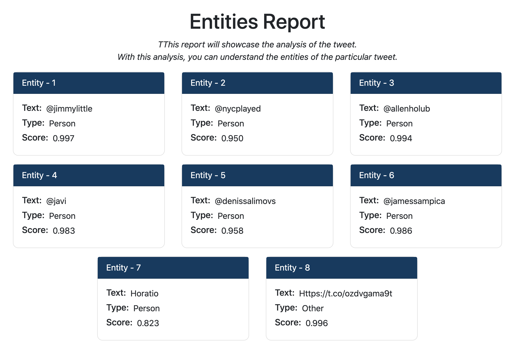

## Tweet Analysis [Hindi]
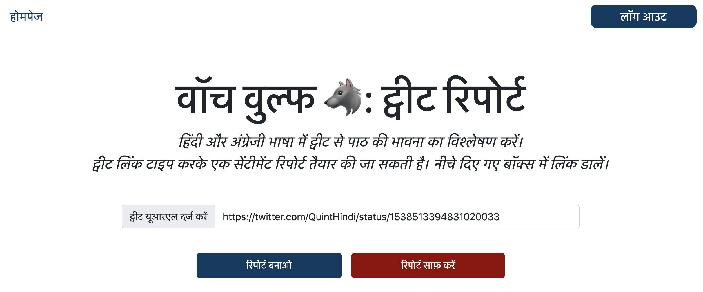
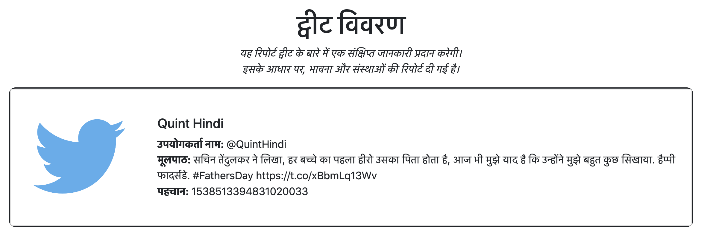
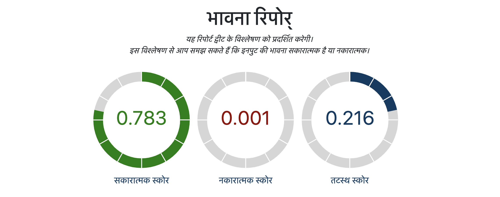
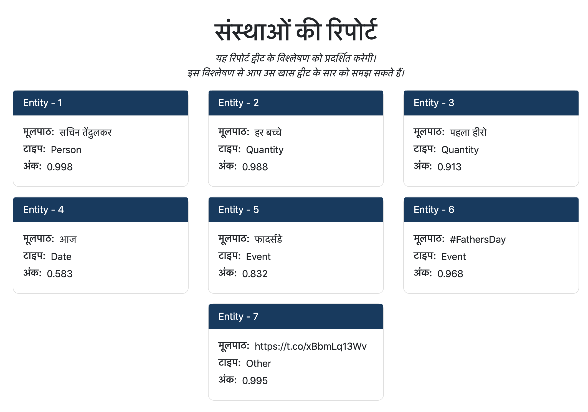

# Extension Interface 

## Positive Tweet 
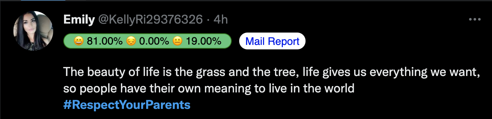

## Negative Tweet 
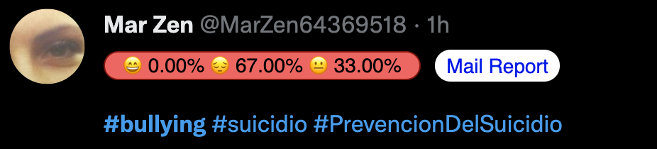

## Neutral Tweet


# Authors 
We, the team Twelfth Hour are the authors of Watch Wolf. Follow us if you find us interesting 💻😄 as we are two big time computer geeks. 

## Aemie Jariwala
📌 `Github`: https://github.com/AemieJ <br/>
📌 `LinkedIn`: https://www.linkedin.com/in/aemie-jariwala/ <br/>
📌 `Blog`: https://dev.to/aemiej <br/>
📌 `Website`: https://aemiej.netlify.app/ <br/>

## Sahil Bondre
📌 `Github`: https://github.com/godcrampy <br/>
📌 `LinkedIn`: https://www.linkedin.com/in/sahil-bondre/ <br/>
📌 `Blog`: https://dev.to/godcrampy <br/>
📌 `Website`: https://sahil.surge.sh/ <br/>
📌 `Twitter`: https://twitter.com/godcrampy <br/>